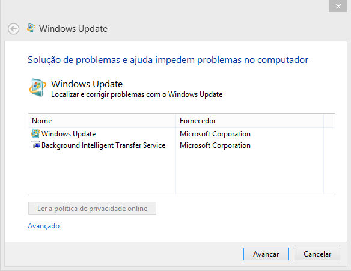
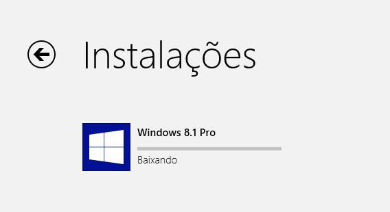

Quem já precisou formatar um PC e acabou caindo no Windows 8 sabe como é uma dor de cabeça realizar o upgrade para o Windows 8.1. Para me auxiliar nessa tarefa em um futuro não muito distante e até mesmo ajudar pessoas que apresentem o mesmo problema criei este pequeno guia.

<em>Siga-me os bons!</em>

## 1. Rode o [Windows Update Diagnostic](http://go.microsoft.com/?linkid=9830262).

O Update Diagnostic é uma ferramenta desenvolvida pela Microsoft que promete solucionar a maioria dos problemas apresentados pelo Windows Update e seu uso é muito simples, basta acessar o [site da ferramenta](http://windows.microsoft.com/pt-br/windows/troubleshoot-problems-installing-updates#1TC=windows-8) e clicar em executar o **Windows Solucionador de Problemas de Atualização**.

Após o download você deve seguir o processo básico de instalação de programas no Windows: Avançar, Avançar, Concluir. Recomendo a reinicialização do computador, só para garantir que todas as modificações foram efetivadas.

## 2. Instale as atualizações necessárias para ter acesso a nova versão do Windows.

A imposição da Windows Store ser o único meio de realizar essa migração é uma das maiores mancadas da Microsoft, só quem teve tempo suficiente para viver no Windows 8 sabe como a loja é instável e mal acabada. Para conseguir ter acesso ao famigerado anúncio que indica a disponibilidade da migração você precisa instalar uma atualização em seu computador.

Para isso vá em Painel de Controle > Sistema e Segurança > Windows Update e clique em Procurar Atualizações, no fim do processo você encontrará uma lista de updates disponíveis, desmaque todos e procure os itens com os seguintes códigos: KB 2871389 ou KB 2917499. Só instale ele e reinciei o computador para aplicar as modificações.

Caso ainda não consiga realizar downloads no Windows Update, baixe as atualizações manualmente: [KB 2871389](http://www.microsoft.com/pt-br/download/details.aspx?id=40076) ou [KB 2917499](http://www.microsoft.com/pt-br/download/details.aspx?id=41587) (Primeiramente só instale um, escolha de acordo com a atualização que foi disponibilizada para você no Windows Update. Ex: Se apareceu o Update KB 2871389, só baixe ele).

## 3. Instale o Windows 8.1 pela Windows Store.

Depois de realizar esses passos você já deve ter acesso ao Windows 8.1 na Windows Store e vai conseguir realizar a instalação sem grandes transtornos.

<em>Yay!</em>

## PUTA MERDA: Mas Diego, ainda não estou conseguindo…

Bom, nesse caso a saída será burlar o sistema de Downloads da Microsoft e para realizar essa façanha você vai precisar de uma Product Key original do Windows 8. Vamos as instruções:

1. Acesse a [página de download do Windows](http://windows.microsoft.com/pt-br/windows-8/upgrade-product-key-only) e clique em **[Instalar o Windows 8](http://go.microsoft.com/fwlink/p/?LinkID=317630)**.
2. Após realizar o download do assistente, execute e informe sua Product Key.
3. Quando o download do Windows estiver entre 1% e 5% clique em pause e feche o programa.
4. Volte a [página de download](http://windows.microsoft.com/pt-br/windows-8/upgrade-product-key-only) e clique agora em **[Instalar o Windows 8.1](http://go.microsoft.com/fwlink/p/?LinkId=271128)**.
5. Ao executar o assistente ele não vai pedir sua Product Key e completará o download do Windows.
6. Execute a instalação seguindo as instruções do programa.

Essa solução pode não funcionar para todos os casos, mas se você chegou até aqui não tem muito o que perder, né?
