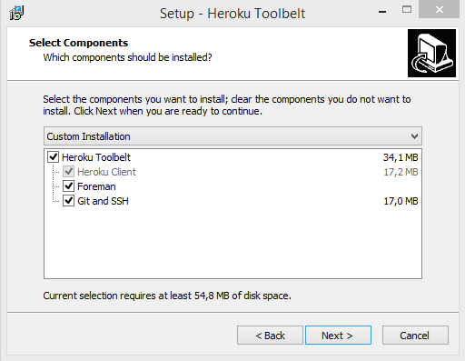
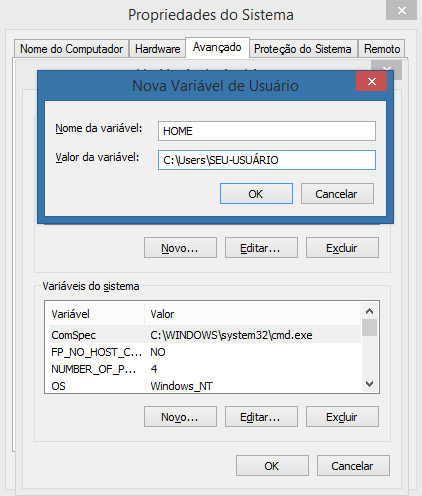

Quem nunca precisou colocar aquela aplicação em produção para testar ou até mesmo compartilhar com colegas e ficou impedido por não ter um servidor bom para uso gratuito?

Bom, seus problemas acabaram…


O **[Heroku](http://heroku.com/)** é um serviço de Cloud da Salesforce.com que permite subir aplicações, pagando apenas pelo que usar, e o melhor é que o plano inicial é gratuito e te dá acesso a banco de dados. Nele é possível rodar sua aplicação em Ruby, PHP, Node.js, Python, Java, Scala ou Clojure e o processo de deploy é muito simples e sem burocracia.

## Heroku Toolbelt

Para colocar seu projeto no Heroku você precisa do **[Toolbelt](https://toolbelt.heroku.com/)**, uma ferramenta multi-plataforma que te permite realizar deploys de sua aplicação de maneira simples através do terminal de seu computador.

Para começar é bastante simples, primeiro você precisa acessar o **[site da ferramenta](https://toolbelt.heroku.com/)**, realizar o download da versão disponível para seu sistema operacional e seguir o processo de instalação: Next, Next, Install.

Atenção, caso você não utilize GIT e SSH é obrigatório escolher a opção Custom Installation e marcar o box para Git and SSH.



<center>Next, Next, Install</center>

Após realizada a instalação, precisamos autenticar o cliente, abra seu terminal e escreva o seguinte comando:

```shell
heroku login
```

Ao digitar isso vai ser solicitado que você entre com suas [credenciais (e-mail e senha)](https://signup.heroku.com/login), coloque seus os dados e se aparecer a mensagem _“Authentication successful.”_ estamos no caminho certo.

Se você já é um usuário GIT pule pro próximo comando, mas se você acabou de instalar o GIT, através da opção _Git and SSH_ do Tooltbelt, temos que criar sua chave SSH para identificar seu computador, digite o comando abaixo:

```shell
ssh-keygen -t rsa
```

A confirmação que tudo ocorreu perfeitamente é um retorno parecido com a mensagem abaixo, caso não esteja recebendo vá até o final do artigo para conferir uma possível solução.

```shell
Your identification has been saved in /Users/Diego/.ssh/id_rsa.
Your public key has been saved in /Users/Diego/.ssh/id_rsa.pub.
The key fingerprint is:
a6:88:0a:0b:...
```

Agora em poder da chave, o próximo passo será enviar para o Heroku , basta digitar:

```shell
heroku keys:add
```

E para verificar se tudo está correto, digite:

```shell
ssh -v git@heroku.com
```

Em algum momento deve ser exibida a mensagem _“Authenticated to heroku.com”_. O que nos leva ao próximo tópico.

## Minha primeira aplicação

Se você chegou até aqui deve estar ansioso para colocar sua aplicação em produção, e o processo de deploy é bem mais simples quanto configurar todo o ambiente.

Primeiro você precisa entrar no diretório de sua aplicação ou criar uma nova.

Atenção! De acordo com a tecnológia adotada (Ruby, Python, Scala, NodeJS, …) pode ser necessário alguns requisitos extras que não vou entrar em detalhes pois esse artigo ficaria muito grande, a melhor forma de verificar isso é acessando o _[Getting Started](https://devcenter.heroku.com/start)_, mas não se preocupe pois não é nada complexo, por exemplo: o Ruby pede que você tenha a gem Bundler instalada enquanto o PHP requer o uso do Composer.

Bom, dentro do diretório execute os seguintes comandos:

```shell
git init && heroku create nome-da-minha-app
```

Ao executar estes comandos você está adicionando o controle de versão em seu projeto e de quebra, criando a aplicação dentro do Heroku. Lembrando que onde tem “nome-da-minha-app” você deve colocar o nome que deseja para endereço no herokuapp.com. O retorno será o seguinte:

```shell
Creating nome-da-minha-app... done, stack is cedar-14
http://nome-da-minha-app.herokuapp.com/ | https://git.heroku.com/nome-da-minha-app.git
Git remote heroku added
```

O próximo passo é realizar o primeiro commit e preparar os arquivos para deploy através do comando abaixo:

```shell
git commit -am "meu primeiro commit"
```

Agora enviamos tudo para o Heroku:

```shell
git push heroku master
```

Esse processo pode demorar alguns minutos a depender da complexidade de sua aplicação e sua conexão com a internet. Ao fim do processo, para verificar sua aplicação online, execute o seguinte comando:

```shell
heroku open
```

Atenção! Trabalhar com banco de dados requer passos extras e varia de acordo com a tecnologia adotada, novamente recomendo o uso do _[Getting Started](https://devcenter.heroku.com/start)_ para verificar esses detalhes.

## [HEEEELP] Criando chaves SSH no Windows

```shell
No such file or directory.
No such host or network path.
Saving the key failed: //.ssh/id_rsa.
```

Se você for usuário Windows e se ao realizar o comando _**ssh-keygen -t rsa**_ está recebendo as mensagens acima, o problema pode ser nas variáveis de ambiente de seu computador.

Para resolver esse problema você deve ir em Painel de Controle > Sistema e Segurança > Sistema, clicar em Configurações avançadas do sistema, em seguida em Variáveis de Ambiente.

Dentro do box Variáveis de usuário clique em Novo e informe os seguintes dados:

**Nome da Variável**: HOME

**Valor da Variável**: C:\Users\SEU-USUÁRIO

Sendo que _SEU-USUÁRIO_ é o nome do seu diretório em \_C:\Users\_

Por fim, clique em OK, OK e OK.



<center>Criando uma variável de ambiente no Windows</center>
