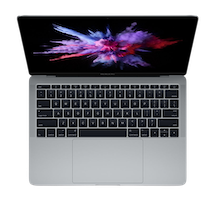
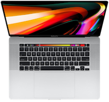
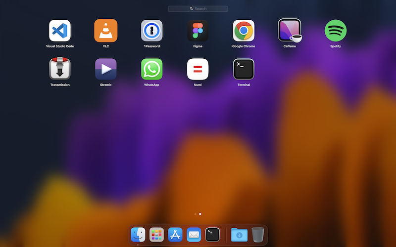

**Last update**: Feb 2023

Welcome to my `/uses` page where I share the tools that make my life easier. This page was inspired by Wes Bos and the community at [uses.tech](https://uses.tech)

## Devices

<table class="uses-table">
  <tr>
    <td>
        
      <strong>Personal Computer</strong>  
      MacBook Pro (13-inch, 2017)  
      2,3 GHz Dual-Core Intel Core i5  
      8 GB 2133 MHz LPDDR3  
      Intel Iris Plus Graphics 640 1536 MB
    </td>
    <td>
        
      <strong>Work Computer</strong>  
      MacBook Pro (16-inch, 2019)  
      2,3 GHz 8-Core Intel Core i9  
      16 GB 2667 MHz DDR4  
      AMD Radeon Pro 5500M 4 GB
    </td>
  </tr>
</table>

**Peripherals and Accessories**

- **Keyboard**: [Logitech MX Keys Wireless Keyboard](https://www.logitech.com/en-us/products/keyboards/mx-keys-wireless-keyboard.html).
- **Mouse**: [Logitech MX Master 2s](https://www.logitech.com/en-us/eol/mx-master-2s-mouse.910-005131.html).
- **Monitor**: [Dell 27' 4k USB-C Monitor p2721q](https://www.dell.com/en-us/shop/dell-27-4k-usb-c-monitor-p2721q/apd/210-axlt/monitors-monitor-accessories).
- **Webcam**: [Logitech C920S Pro HD Webcam](https://www.logitech.com/en-us/products/webcams/c920s-pro-hd-webcam.960-001257.html).
- **Laptop Stand**: [Rain Design mStand Laptop Stand](https://www.raindesigninc.com/mstand.html) and [Twelve South BookArc](https://www.twelvesouth.com/products/bookarc-macbook).
- **Audio**: [Samsung Galaxy Buds2 Pro Graphite](https://www.samsung.com/us/mobile/audio/headphones/galaxy-buds2-pro-graphite-sm-r510nzaaxar/) and [Razer Kraken X](https://www.razer.com/console-headsets/Razer-Kraken-X-For-Console/RZ04-02890200-R3M1)
- **Phone**: [Samsung Galaxy Z Flip 4 128GB Graphite](https://www.samsung.com/us/smartphones/galaxy-z-flip4/)
- **Watch**: [Samsung Galaxy Watch 5 Silver 44mm Silver](https://www.samsung.com/us/watches/galaxy-watch5/buy/?skipDevice=galaxy-watch5)
- **Tablet**: [Samsung Galaxy Tab S8 5G 256GB Graphite](https://www.samsung.com/us/tablets/galaxy-tab-s8/buy/?modelCode=SM-X700NIDAXAR) with [Book Cover Keyboard](https://www.samsung.com/us/mobile/mobile-accessories/tablets/galaxy-tab-s8-galaxy-tab-s7-book-cover-keyboard-black-ef-dt870ubeguj/)
- **Gaming**: [Sony Playstation 4 Pro](https://www.playstation.com/en-us/ps4/ps4-pro/)
- **Photography**: [Canon EOS Rebel T7](https://www.usa.canon.com/shop/p/eos-rebel-t7-ef-s-18-55mm-f-3-5-5-6-is-ii?color=Black&type=New) with [EF 50mm f/1.8 STM](https://www.usa.canon.com/shop/p/ef-50mm-f-1-8-stm?color=Black&type=New) and [EF 75-300mm f/4-5.6 III](https://www.usa.canon.com/shop/p/ef-75-300mm-f-4-5-6-iii?color=Black&type=New) lens.
- **Desk**: [Husky Standing Desk](https://www.kabum.com.br/produto/135439/mesa-office-husky-technologies-900-oak-branco-e-madeira-natural-regulagem-de-altura-automatica-memorizacao-4-usuarios-anti-esmagamento-htct000) with custom top.

## Apps and Tools

I maintain a clean suite of apps installed on my personal computer.

- Visual Studio Code with [Jetbrains Mono](https://www.jetbrains.com/lp/mono/) and other good extensions: [Auto Close Tag](https://marketplace.visualstudio.com/items?itemName=formulahendry.auto-close-tag), [Auto Rename Tag](https://marketplace.visualstudio.com/items?itemName=formulahendry.auto-rename-tag), [Color Highlight](https://marketplace.visualstudio.com/items?itemName=naumovs.color-highlight), [Dart](https://marketplace.visualstudio.com/items?itemName=Dart-Code.dart-code), [DotENV](https://marketplace.visualstudio.com/items?itemName=mikestead.dotenv), [EditorConfig for VS Code](https://marketplace.visualstudio.com/items?itemName=EditorConfig.EditorConfig), [ESLint](https://marketplace.visualstudio.com/items?itemName=dbaeumer.vscode-eslint), [file-icons](https://marketplace.visualstudio.com/items?itemName=file-icons.file-icons), [Flutter](https://marketplace.visualstudio.com/items?itemName=Dart-Code.flutter), [GraphQL: Language Feature Support](https://marketplace.visualstudio.com/items?itemName=GraphQL.vscode-graphql), [GraphQL: Syntax Highlighting](https://marketplace.visualstudio.com/items?itemName=GraphQL.vscode-graphql-syntax), [PlantUML](https://marketplace.visualstudio.com/items?itemName=jebbs.plantuml), [Polacode](https://marketplace.visualstudio.com/items?itemName=pnp.polacode), [Rainbow CSV](https://marketplace.visualstudio.com/items?itemName=mechatroner.rainbow-csv), and [YAML](https://marketplace.visualstudio.com/items?itemName=redhat.vscode-yaml).
- MacOS' Terminal with [Oh My Zsh](https://ohmyz.sh/).
- 1Password to manage my credentials and 2FA.
- [Numi](https://numi.app/) is my favorite calculator, beautiful and powerful.
- [Homebrew](https://brew.sh) to manage all my software on macOS.
- [Transmission](https://transmissionbt.com/) to download torrent files.
- Google Chrome as main browser.
- [Figma](https://www.figma.com/) for prototyping.
- [VLC](https://www.videolan.org/) to watch local files.
- [Stremio](https://www.stremio.com/) to find magnet links to stream on VLC.
