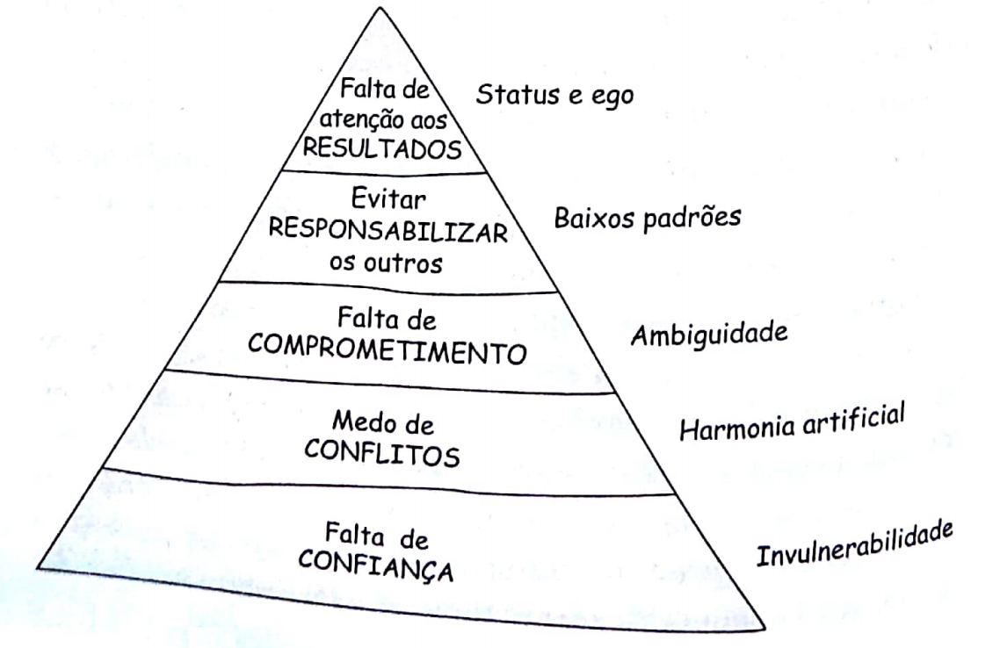

Quando você é desenvolvedor de softwares existe uma infinidade de conteúdo técnicos te dizendo o que precisa ser feito ou a melhor forma de lidar com os problemas que podem surgir no dia-a-dia. 

Quando você resolve fazer a transição para trilha de gestão tudo muda, não há regras definidas, não há um roadmap exato do que estudar e muito menos algo que te diga, "você está pronto". Diante desse cenário nos últimos três anos, tentei me aperfeiçoar através de diversas literaturas pois na minha opinião, entender os desafios de quem teve que trilhar esse caminho antes de você é a melhor forma de construir um repertório para quando você vivencie problemas semelhantes.

Hoje quero falar de 4 livros que li em 2020 e que de certa forma me impactaram.

### Os 5 desafios das equipes

Através de suas 200 páginas de uma leitura leve e bastante divertida, este livro aborda como a falta de confiança, medo de conflitos, falta de comprometimento, evitar responsabilizar os outros e a falta de atenção aos resultados podem impactar negativamente nas relações e na materialização dos resultados através de exemplos e planos de ações.

Ao final, também somos apresentados a uma forma de reconhecer se seu time está passando pelos mesmos problemas através de uma dinâmica. Eu tive a oportunidade de aplicá-la em meu time e o resultado foi bastante positivo, recebi ótimos feedbacks do momento e o mais importante, a conexão das pessoas do time se tornaram mais sólidas pelo simples fato das pessoas se permitem ser vulneráveis na frente dos colegas.

### An Elegant Puzzle: Systems of Engineering Management

Dos quatro livros este é o mais técnico, ele se aprofunda em como resolver os maiores desafios de engenharia que um manager pode encontrar. Desafios de como lidar com times de engenharia, processos, ferramental, contratação e até formação de times altamente performáticos.

O que tirei de mais proveitoso desse livro foi a forma de identificar em qual estágio de maturidade meu time se encontrava, o que isso representava e o que fazer para ir para o próximo nível. Com muito trabalho conseguimos sair de Falling Behind para Treading Water.

### Métricas ágeis: obtenha melhores resultados em sua equipe

Esse livro me foi recomendado por um grande amigo Agilista e confesso que antes dele eu não tinha noção da importância das métricas ágeis. 

Durante boa parte de minha jornada como gestor eu enxergava esses números como apenas números, desconhecia o poder que mensurar lead time, throughput e outras métricas poderiam te acender alertas e ser uma ferramenta poderosa na construção de times performáticos.

Mas antes de partir para o próximo título gostaria de trazer um conselho que recebi de uma liderança, medir por medir vai ser perda de tempo. Encontre um problema, encontre as métricas para mensurar o tamanho dele e trabalhe para resolve-las.

### The Manager's Path: A Guide for Tech Leaders Navigating Growth and Change

Esta é minha leitura atual e é talvez a melhor recomendação para quem quer ser um bom gestor. Nele somos apresentados a formas de conduzir bons 1:1, feedback contínuo, mentoria, performance review e muito outros tópicos que podem ser bem úteis em sua jornada.

Quando eu finalizar e conseguir digerir esse tanto de informação eu volto com um review completo do livro.
